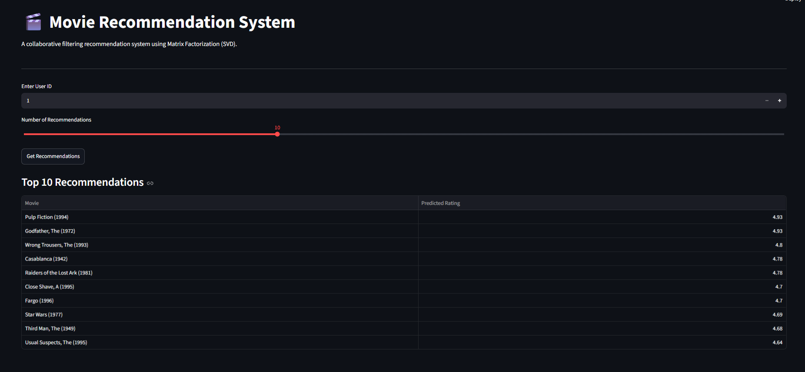

# Movie Recommendation System

A movie recommendation system built using the **MovieLens 100K dataset**. The project explores different collaborative filtering approaches and uses **SVD Matrix Factorization** to predict movie ratings and generate Top-N recommendations for users.

The final model is connected to a simple **Streamlit application** where a user can enter a User ID and get personalized movie recommendations.

---

## Why I Built This

I wanted to understand how recommendation systems work beyond simply recommending the most popular movies.

This project helped me work through the complete process — from exploring user-rating data and building collaborative filtering models to evaluating the models and turning the final model into a small interactive application.

---

## What the Project Does

The system:

- Analyzes movie rating patterns
- Explores user and movie activity
- Builds User-Based Collaborative Filtering
- Builds Item-Based Collaborative Filtering
- Trains an SVD Matrix Factorization model
- Evaluates the recommendation models
- Generates Top-N movie recommendations
- Provides an interactive Streamlit interface

---

## Dataset

The project uses the **MovieLens 100K dataset** from GroupLens Research.

The dataset contains:

- **100,000 ratings**
- **943 users**
- **1,682 movies**
- Ratings from **1 to 5**

The main files used are:

u.data
u.item
---

## Tech Stack

- **Python** — Data processing, model development, and recommendation logic
- **Pandas & NumPy** — Data cleaning, transformation, and numerical operations
- **Scikit-learn** — Train-test splitting, evaluation, and PCA visualization
- **Scikit-Surprise** — Collaborative filtering and SVD matrix factorization
- **Matplotlib** — Data exploration and visualizations
- **Streamlit** — Interactive recommendation application
- **Jupyter Notebook** — End-to-end analysis, experimentation, and model development

---

## Project Workflow

### 1. Exploratory Data Analysis

The project starts with an analysis of the MovieLens rating data to understand user and movie behavior.

The analysis includes:

- Rating distribution
- Number of users and movies
- User activity
- Movie activity
- Popular movies
- Rating matrix sparsity

The dataset contains **100,000 ratings from 943 users across 1,682 movies**.

### 2. Train-Test Split

The ratings were divided into training and testing sets to evaluate how well the recommendation models perform on unseen data.

Training Set: 80,000 ratings
Test Set:     20,000 ratings

### 3. User-Based Collaborative Filtering

User-based collaborative filtering recommends movies by identifying users with similar rating patterns.

The approach compares user preferences and uses similar users' ratings to estimate how a user may rate movies they have not previously rated.

The model was evaluated on the test dataset using RMSE and MAPE to measure prediction performance.

---

### 4. Item-Based Collaborative Filtering

Item-based collaborative filtering focuses on similarities between movies based on how users have rated them.

Instead of finding similar users, this approach identifies movies with similar rating patterns and uses those relationships to estimate ratings for movies a user has not rated.

The model was evaluated using the same test dataset so that its performance could be compared with the user-based approach.

---

### 5. SVD Matrix Factorization

The final recommendation model uses **Singular Value Decomposition (SVD)** through Scikit-Surprise.

SVD learns latent factors from the user-movie rating data and uses these factors to predict ratings for movies that a user has not rated.

The model was trained using:

n_factors = 50
n_epochs = 20
learning_rate = 0.005
regularization = 0.02
random_state = 42

### 6. Top-N Recommendations

For a given User ID, the trained SVD model predicts ratings for movies and ranks them by predicted score.

The highest-ranked movies are returned as the user's **Top-N recommendations**.

The Streamlit application allows the user to select how many recommendations they want to receive.

---

### 7. PCA Visualization

PCA was used to visualize the latent representation of the recommendation data.

This provides a simpler two-dimensional view of the patterns captured by the model and helps understand the structure of the learned representations.

---

## Model Evaluation

The three recommendation approaches were evaluated using **RMSE** and **MAPE**.

| Model | RMSE | MAPE |
|---|---:|---:|
| User-Based Collaborative Filtering | 0.9911 | 30.78% |
| Item-Based Collaborative Filtering | 0.9602 | 31.18% |
| SVD Matrix Factorization | **0.9348** | **29.79%** |

SVD achieved the lowest RMSE and MAPE among the three approaches evaluated in this project.

### Recommendation Metrics

The quality of the Top-10 recommendations was also evaluated using Precision@10 and Recall@10.

| Metric | Score |
|---|---:|
| Precision@10 | 0.5822 |
| Recall@10 | 0.7215 |

---

## Streamlit Application

The trained SVD model was integrated into a Streamlit application to make the recommendation system interactive.

The application allows users to:

- Enter a User ID
- Select the number of recommendations
- Generate personalized movie recommendations

### Application Demo

---

## Example Recommendations

For User ID 1, the system generated the following Top-5 recommendations:

| Movie | Predicted Rating |
|---|---:|
| Pulp Fiction (1994) | 4.93 |
| Godfather, The (1972) | 4.93 |
| Wrong Trousers, The (1993) | 4.80 |
| Casablanca (1942) | 4.78 |
| Raiders of the Lost Ark (1981) | 4.78 |

---

